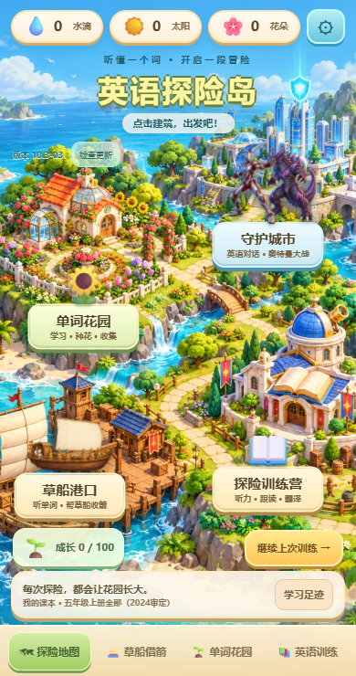

# 英语探险岛 · 10.3-03

网址：https://lesliedavidb78-code.github.io/english-garden-games/

## 从地图出发

首页是一座立体探险小岛，石板路连接四个可以点击的区域：

| 地点 | 可以做什么 |
| --- | --- |
| 单词花园 | 拼字、听音找花，选择六种种子，浇水、晒太阳 |
| 草船港口 | 听单词、点单词雨，自动射箭，累计十次漏水沉船 |
| 守护城市 | 直接进入奥特曼英语对话大战，帮助居民恢复通讯 |
| 探险训练营 | 选择听力、跟读、反应、词义、对话、句子翻译 |

建筑旁有浮动的船、英雄与怪兽等标记。顶部显示实际拥有的水滴、太阳和花朵，齿轮进入家长设置。学习足迹汇总已有记录；有未完成的训练或借箭时，可以继续上次游戏。

地图、训练营和花园采用同一套明亮、立体、温暖的配色。短横屏把地图和四个目的地放在两侧；短竖屏简化装饰，为入口、历史和导航留出空间。答题时使用原有独立的全屏布局，题目、操作、正确答案和下一题保持在网页可用区域内。微信和浏览器自身的顶栏不受网页控制。

## 城市里发生了什么

怪兽想占领地球，切断城市通讯。奥特曼保护居民，孩子担任英文救援通讯员：接通通讯 → 护送居民 → 重启地球护盾。

角色使用新生成的透明原画。战斗包含蓄力、冲刺、后退、命中停顿、闪光与动态火花；五连答对触发光束。对话逐字出现，点击可立即展开。

累计十次答对胜利、十次答错失败；答对不会抵消已有伤害。答后全部选项锁定，正确回复标绿、错误选择标红；对话框显示正确英文与中文，演出后点下一题。奖励按实际作答结算。

## 声音和动画素材交接

可以直接把《奥特曼地球守护战_音频与动画制作任务单.md》发给其他 AI。它完整说明世界观、角色、配音台词、触发点、音效层次、背景音乐和七段动画分镜，不依赖本次聊天。

本版已接入本地合成的战斗音效，英文示范优先。新版真人风格角色配音和 BGM 待外部素材；AI 动画视频尚未生成或接入。当前动作来自网页图层与动态特效。《地球守护战_网页动画实录.mp4》是实际网页的无声屏幕实录，供判断动作效果。

跟读继续采用已确认的纯本地录音方案：按住麦克风、松开后回听，不上传录音、不自动评测发音，也不因为录音或跳过发奖励。

## 更新和存档

在地图或原游戏页点击“检查更新”，看到版本 **10.3-03** 后再试玩。请保留原网址和当前浏览器，存档存在手机本地；不同浏览器不会自动共享存档，可以用家长设置里的导出/导入备份转移。不要清除网站数据。

新原画、英文音频等需要首次联网下载；离线资源准备完成后，地图和游戏可离线打开。更新过程不会主动中断正在进行的答题。

验证报告包括地图真实入口与存档、七种视口下入口遮挡、六项训练和长句复盘、花园答题同屏、累计计分与奖励、断网资源。自动化使用 Chrome 模拟视口和指针操作，手机真机的声音、麦克风和微信顶栏仍需实际试用。

## 后续扩展

地图新增地点的方式见《assets/map-art/地图美术与扩展说明.md》。新增入口必须连接可玩的游戏；沿用本地进度、奖励与返回地图，避免仅放不可点击的装饰按钮。
